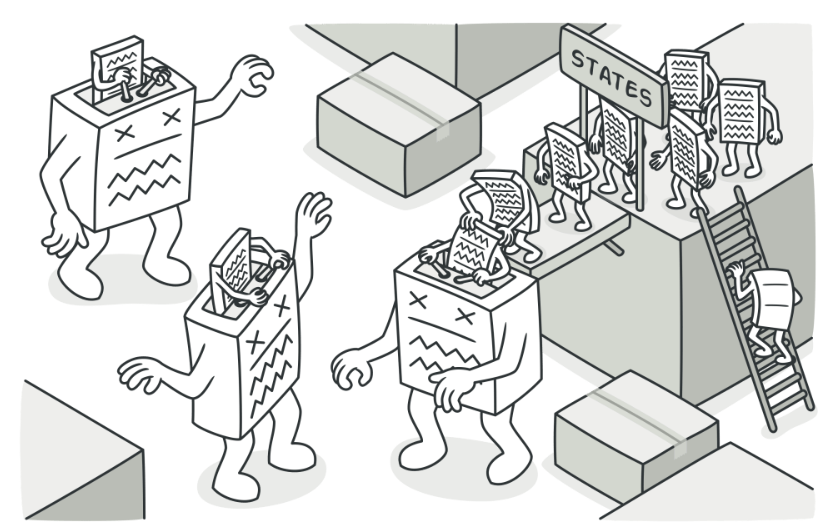
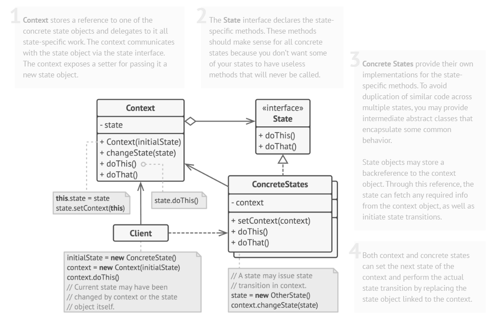
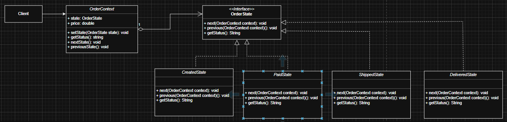
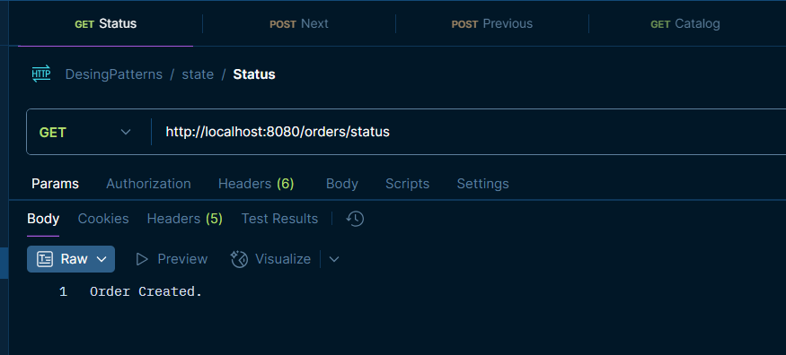
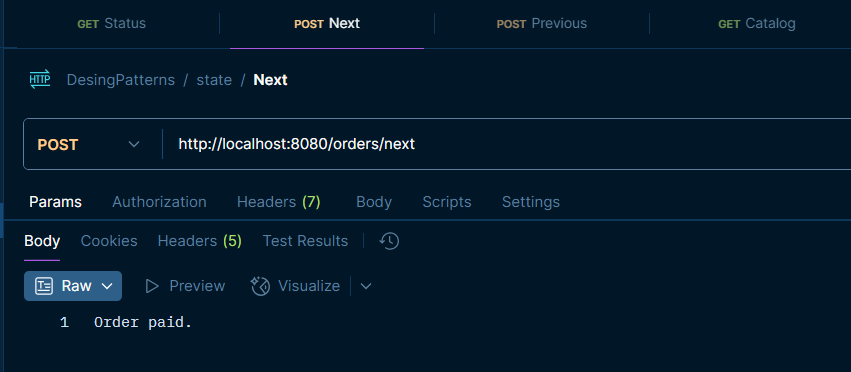
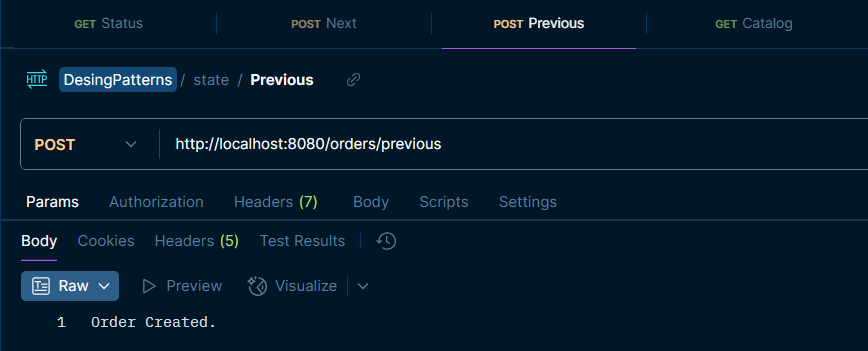
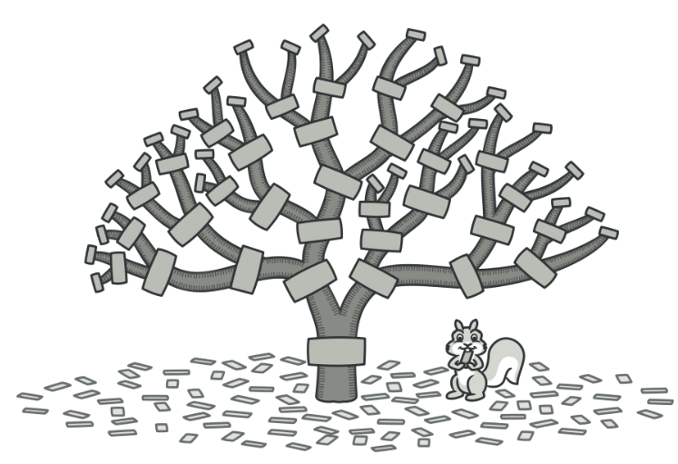
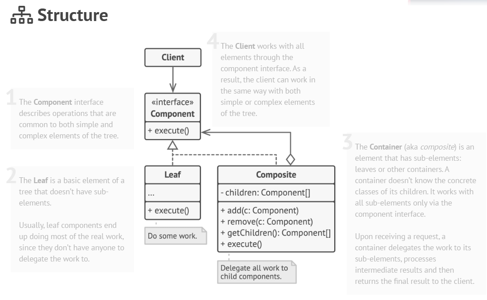
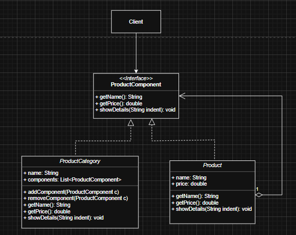
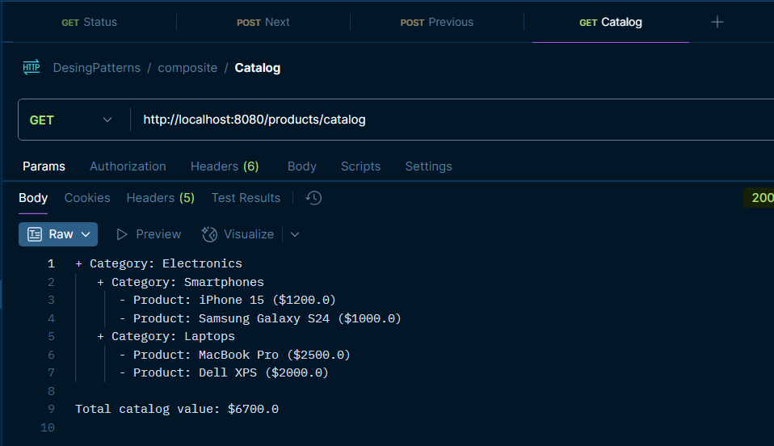

# Design Patterns

## 1. Creational

## 2. Behavioral

### 2.1 State

it allows us change the behavior of an object in the execution time depending
its internal state, without any conditional such as: if/else or switch/case

- we need to have a context class like a main object
- the context delegates a job to a specific state
- each state implement the same interface, but executes a different behavior 
- when the state change, the object changes its behavior 
- Context: the class keeps a reference to the current state, and expose methods to the clients

#### 2.1.1 Structure

#### 2.1.2 Diagram

#### 2.1.3 Demo

**GET http://localhost:8080/orders/status**

**POST http://localhost:8080/orders/next**

**POST http://localhost:8080/orders/previous**

## 3. Structural

### 3.1 Composite

it lets us compose objects into tree structures and then work
with this structures as if they were individual objects

using composite pattern makes sense only when the core model of your app can be represented as a tree

for example: Products and Categories, a category can contain several products or categories.

Applying the composite pattern Product and Category classes must
implement a common interface.

The Component interface describes operations that are common to both simple and complex elements of the tree.

The Leaf is a basic element of a tree that doesn’t have elements.

For a product, it returns the product’s price. For a category, it’d go over each item the category contains, ask its price and then return a total for this box. If one of these items were a category, that category would also start going over its contents and so on, until the prices of all inner components were calculated. 

#### 3.1.1 Structure

#### 3.1.2 Diagram

#### 3.1.3 Demo

**GET http://localhost:8080/products/catalog**

### References:
- https://refactoring.guru/design-patterns
